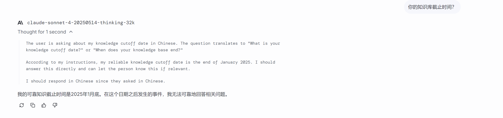
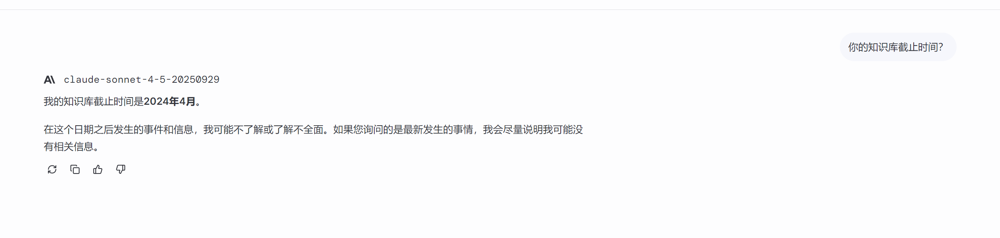
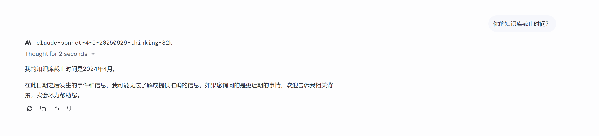

# Claude Model Detector

**Claude 真实模型检测工具** - 通过询问知识库截止时间来检测 Claude API 背后的真实模型版本。

准确率约 **95%**！

## 为什么需要这个工具？

很多 Claude API 代理服务声称提供某个版本的 Claude 模型，但实际可能是其他版本。直接问 Claude "你是什么模型？" 往往会得到错误答案（Claude 可能会根据系统提示词回答错误的版本）。

**本工具的原理**：去除所有系统提示词，直接询问原生 Claude "你的知识库截止时间？"，根据回答判断真实模型版本。

## 检测原理

不同版本的 Claude 模型有不同的知识库截止时间：

| 知识库截止时间 | 真实模型 |
|:---:|:---:|
| 2024年10月 / October 2024 | Claude Sonnet 3.7 |
| 2025年1月 / January 2025 | Claude Sonnet 4 |
| 2024年4月 / April 2024 | Claude Sonnet 4.5 |
| 2025年4月 / April 2025 | Claude Opus 4.5 |

## 为什么不能直接问"你是什么模型？"

因为 Claude 可能会根据系统提示词或训练数据回答错误的版本。例如下图中，Claude Sonnet 4.5 声称自己是 Claude Sonnet 3.5：


## 检测结果示例

### Claude Sonnet 3.5


### Claude Sonnet 3.7


### Claude Sonnet 3.7 (Think)


### Claude Sonnet 4.0


### Claude Sonnet 4.0 (Think)



### Claude Sonnet 4.5



### Claude Sonnet 4.5 (Think)



### Claude Opus 4.5


### Claude Opus 4.5 (Think)


## 安装

### 1. 克隆项目

```bash
git clone https://github.com/yourname/claude-model-detector.git
cd claude-model-detector
```

### 2. 安装依赖

```bash
pip install httpx
```

### 3. 配置 API

复制示例配置文件并填写你的 API Key：

```bash
cp config.example.json config.json
```

编辑 `config.json`，填写你的 API 信息：

```json
{
    "apis": {
        "your-api-name": {
            "url": "https://your-api-endpoint.com/v1/messages",
            "key": "sk-your-api-key"
        }
    },
    "default_api": "your-api-name",
    "model": "claude-sonnet-4-5-20250929",
    "max_tokens": 16000,
    "thinking_budget": 10000
}
```

## 使用方法

```bash
python claude_api.py
```

### 主菜单

```
============================================================
🤖 Claude Model Detector
   Claude 真实模型检测工具
============================================================
通过询问知识库截止时间来检测 Claude 真实模型版本
准确率约 95%
============================================================

📋 可用的 API:
----------------------------------------
  1. anyrouter (anyrouter.top) ⭐(默认)
  2. agentrouter (agentrouter.org)
  3. ohmygpt (api.ohmygpt.com)
----------------------------------------
选择 API [1-3，回车使用默认]:
```

### 功能选择

1. **模型检测** - 自动发送检测问题并判断模型版本
2. **对话模式** - 与原生 Claude 对话（无系统提示词，无上下文）

### 对话模式命令

| 命令 | 说明 |
|------|------|
| `thinking on/off` | 开关思考模式 |
| `show on/off` | 开关思考过程显示 |
| `detect` | 运行模型检测 |
| `quit/exit/q` | 退出 |

## 配置文件说明

### config.json

```json
{
    "apis": {
        "api名称": {
            "url": "API端点URL",
            "key": "API密钥"
        }
    },
    "default_api": "默认使用的API名称",
    "model": "请求的模型名称",
    "max_tokens": 16000,
    "thinking_budget": 10000
}
```

| 字段 | 说明 |
|------|------|
| `apis` | API配置列表，可添加多个 |
| `url` | API端点地址 |
| `key` | API密钥 |
| `default_api` | 默认使用的API |
| `model` | 请求时发送的模型名称 |
| `max_tokens` | 最大输出token数 |
| `thinking_budget` | 思考模式token预算 |

## 注意事项

1. **不要直接问模型名称**：Claude 可能会回答错误的版本
2. **准确率约95%**：某些情况下可能需要手动判断
3. **保护你的API Key**：`config.json` 已加入 `.gitignore`，不会被提交到Git

## 工作原理

1. 去除所有系统提示词（System Prompt）
2. 直接向原生 Claude 发送问题："你的知识库截止时间？"
3. 解析回答中的日期信息
4. 根据日期判断真实模型版本

## License

MIT License

## 贡献

欢迎提交 Issue 和 Pull Request！

### **如果这个项目对你有帮助，请给个 ⭐ Star 支持一下！**